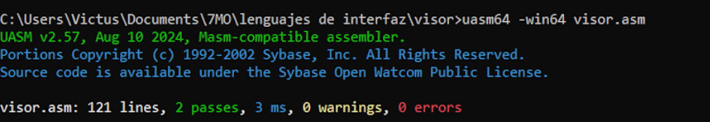
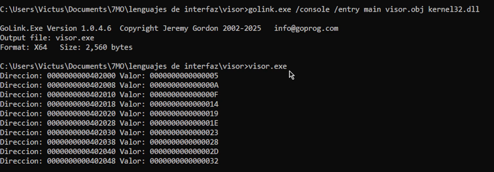

# Proyecto Módulo 1 - Visor de Memoria

**Instituto Tecnológico de Mexicali**  
**Carrera:** Ingeniería en Sistemas Computacionales  
**Materia:** Lenguajes de Interfaz (SCC-1014)  
**Autor:** Julio Alejandro Magaña Nuñez  

## Descripción del Proyecto
Este proyecto consiste en un programa desarrollado en lenguaje ensamblador (x86-64) que actúa como un visor de memoria básico. El programa recorre un arreglo de 10 números de 64 bits (tipo `DQ`) definidos en la sección `.data`, e imprime en consola tanto la dirección de memoria como el valor contenido en formato hexadecimal de 16 dígitos. 

El desarrollo cumple con las siguientes restricciones técnicas:
- Sin uso de macros (código explícito).
- Recorrido mediante direccionamiento indirecto por registro (`[rbx]`).
- Terminación limpia sin el uso de funciones externas como `ExitProcess`.

## Requisitos Previos
Para compilar y ejecutar este código, es necesario contar con un entorno de Windows y las siguientes herramientas:
- **Ensamblador:** MASM (`ml64.exe`).
- **Enlazador (Linker):** GoLink.

## Instrucciones de Compilación y Ejecución

1. Abrir la consola de comandos.
2. Ensamblar el código fuente para generar el archivo objeto (`.obj`):
   ```cmd
   uasm64 -win64 visor.asm
   ```
3. Enlazar el archivo objeto con las librerías necesarias utilizando GoLink:
   ```cmd
   golink.exe /console /entry main visor.obj kernel32.dll
   ```
4. Ejecutar el programa generado:
   ```cmd
   visor.exe
   ```

## Capturas de Pantalla



## Video Demostrativo
https://www.youtube.com/watch?v=RCHnoxaZi5Q
